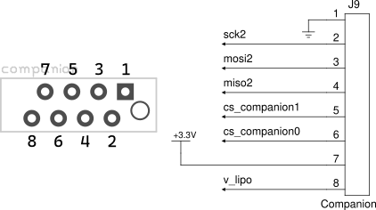

WIP project to create a companion add-on board for [Altus Metrum](https://altusmetrum.org/) flight computers. This companion board is intended to transmit realtime pressure data to the flight computer using a high-pressure pressure sensor for motor characterization similar to the [EasyMotor](https://altusmetrum.org/EasyMotor/), using a low-cost Cortex M0 based microcontroller board ([Adafruit Feather M0 Adalogger](https://www.adafruit.com/product/2796)).

### External Libraries
This project uses the [SercomSPISlave](https://github.com/lenvm/SercomSPISlave) library, since there is no built-in support for using this board in SPI slave mode within Adafruit's libraries. Currently an SPI slave is created using the general-purpose configurable serial port SERCOM4 on the M0.

### Companion Port Pinout
